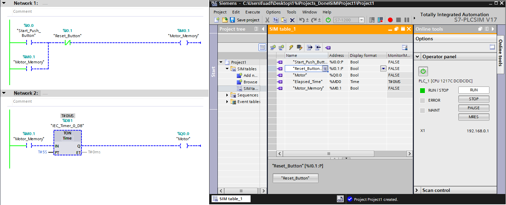

# PLC START/STOP Motor Control with TON Delay

## Objective

Design and simulate a motor control system using:

- START/STOP seal-in logic
- TON timer delay
- Siemens TIA Portal
- PLCSIM monitoring

---

# System Description

The motor starts only after a 5-second delay when the START button is pressed.

The system uses:
- Memory latch logic
- TON timer
- Internal memory bit
- Motor output control

---

# Tags Used

| Tag | Address | Type |
|---|---|---|
| Start_Push_Button | %I0.0 | Bool |
| Reset_Button | %I0.1 | Bool |
| Motor_Memory | %M0.1 | Bool |
| Motor | %Q0.0 | Bool |
| Elapsed_Time | %MD0 | Time |

---

# Logic Sequence

1. START button pressed
2. Memory bit latches ON
3. TON timer starts counting
4. After 5 seconds:
   - TON.Q becomes TRUE
   - Motor turns ON
5. RESET button stops system

---

# PLCSIM Monitoring

---

# Demo Video

[Download Demo Video](Videos/demo.mp4)

---

# Software Used

- Siemens TIA Portal
- Siemens PLCSIM

---

# Skills Learned

- PLC ladder programming
- TON timers
- Seal-in logic
- PLC memory bits
- Industrial motor control logic